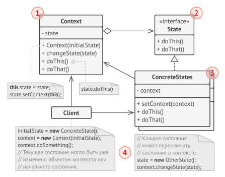

<h1 align="center">
   State
</h1>
<h3 align="center">
   Состояние
</h3>

**Состояние** — это поведенческий паттерн проектирования,который позволяет объектам менять поведение взависимости от
своего состояния. Извне создаётся впечатление, что изменился класс объекта.

Паттерн схож с конечным автоматом и предназначен для избавление от множества if и switch операторов.
Проблема if и switch операторов заключается в их негибоксти и нагромажденности. Зачастую множество if операторов лежит в
одном месте, что ещё больше усложняет понимает контекста. При паттерне **Состояние** особенности поведение переносят в
класс состояния, тем самым убирая множественно ветвление.

*Задумайтесь об использовании **Состояния** там, где у вас много if и switch операторов*.

<h3 align="center">
   Применимость
</h3>

- Когда у вас есть объект, поведение которого кардинально меняется в зависимости от внутреннего состояния. Причём типов
  состояний много и их код часто меняется.
- Когда код класса содержит множество больших, похожих друг на друга, условных операторов, которые выбирают поведения в
  зависимости от текущих значений полей класса.
- Когда вы сознательно используете табличную машину состояний, построенную на условных операторах, но вынуждены мириться
  с дублированием кода для похожих состояний и переходов.

<h3 align="center">
   Реализация
</h3>

1. Определитесь с классом, который будет играть роль контекста. Это может быть как существующий класс, в котором уже
   есть зависимость от состояния, так и новый класс, если код состояний размазан по нескольким классам.
2. Создайте интерфейс состояний. Он должен описывать методы, общие для всех состояний, обнаруженных в контексте.
   Заметьте, что не всё поведение контекста нужно переносить в состояние, а только то, которое зависит от состояний.
3. Для каждого фактического состояния, создайте класс, реализующий интерфейс состояния. Переместите весь код, связанный
   с конкретным состоянием в нужный класс. В конце концов, все методы интерфейса состояния должны быть реализованы.
4. Создайте в контексте поле для хранения объектовсостояний, а также публичный метод для изменения значения этого поля.
5. Старые методы контекста, в которых находился зависимый от состояния код, замените на вызовы соответствующих методов
   объекта-состояния.
6. В зависимости от бизнес-логики, разместите код, который переключает состояние контекста либо внутри контекста, либо
   внутри классов конкретных состояний.

<h3 align="center">
   State UML-диаграмма
</h3>

<h3>Плюсы</h3>

- Избавляет от множества больших условных операторов машины состояний.
- Концентрирует в одном месте код, связанный с определённым состоянием.
- Упрощает код контекста.

<h3>Минусы</h3>

- Может неоправданно усложнить код, если состояний мало и они редко меняются.

<h3 align="center">
   Примеры
</h3>

- [Пример с посылкой.](code)
  Посылка имеет явное ограниченное число состояний. Каждое состояние внутри уже связано со следующим.

<h5>
    Замечание
</h5>

Где и как буду связываться состояния: в клиентском коде, внтури класса, через конструктор - не важно. Это лишь
особенности реализации в конкретном случае.

<h3 align="center">
   Источники
</h3>

- Design Patterns with
  Java: [State](books/Olaf%20Musch%20EN.pdf)
- Введение в паттерны
  проектирования: [Наблюдатель](books/Alexander%20Shvets%20RU.pdf)