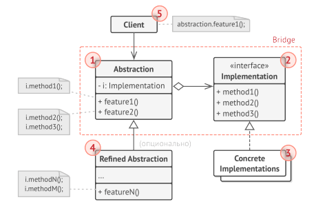

<h1 align="center">
   Bridge
</h1>
<h3 align="center">
   Мост
</h3>

**Мост** — это структурный паттерн проектирования, который разделяет один или несколько классов на две отдельные
иерархии — абстракцию и реализацию, позволяя изменять их независимо друг от друга.

Примеры, когда можно использовать паттерн мост:

1. Если необходимо расширить количество сущностей в две стороны.
2. Если есть желание разделить большой класс, который не отвечает принципу Single responsibility, на более маленькие
   классы с узкопрофильным функционалом.
3. При возможной необходимости вносить изменения в логику работы неких сущностей во время работы программы.
4. При необходимости спрятать реализацию от клиентов класса (библиотеки)

<h3 align="center">
   Абстракция
</h3>

Абстракция — это использование только тех характеристик объекта, которые с достаточной точностью представляют его в
данной системе. Основная идея состоит в том, чтобы представить объект
минимальным набором полей и методов и при этом с достаточной точностью для решаемой задачи.

<h3 align="center">
   Реализация
</h3>

1. Определите, существует ли в ваших классах два непересекающихся измерения. Это может быть функциональность/платформа,
   предметная-область/ инфраструктура, фронт-энд/бэк-энд или интерфейс/ реализация.
2. Продумайте, какие операции будут нужны клиентам и опишите их в базовом классе абстракции.
3. Определите поведения доступные на всех платформах и выделите из них ту часть, которая будет нужная абстракции. На
   основании этого опишите общий интерфейс реализации
4. Для каждой платформы создайте свой класс конкретной реализации. Все они должны следовать общему интерфейсу, который
   мы выделили перед этим.
5. Добавьте в класс абстракции ссылку на объект реализации. Реализуйте методы абстракции, делегируя основную работу
   связанному объекту реализации.
6. Если у вас есть несколько вариаций абстракции, создайте для каждой из них свой подкласс.
7. Клиент должен подать объект реализации в конструктор абстракции, чтобы связать их воедино. После этого он может
   свободно использовать объект абстракции, забыв о реализации.

<h3 align="center">
   Bridge UML-диаграмма
</h3>

<h3>Плюсы</h3>

- Уменьшает количество подклассов — работает при необходимости расширения количества сущностей в две стороны.
- Улучшает масштабируемость кода — можно добавлять функционал, не боясь сломать что-то в другой части программы.
- Дает возможность отдельно работать над двумя самостоятельными ветками Абстракции и Реализации — это могут делать два
  разных разработчика, не вникая в детали кода друг друга.
- Скрывает лишние или опасные детали реализации от клиентского кода.
- Уменьшение связанности классов — единственное место связки двух классов — это мост.
- Реализует принцип открытости/закрытости.

<h3>Минусы</h3>

- Усложняет код программы за счёт дополнительных классов.

<h3 align="center">
   Примеры
</h3>

- [JavaRush: паттерн проектирования мост.](https://javarush.com/groups/posts/2570-znakomstvo-s-patternom-proektirovanija-bridge)
- [Пример с девайсами и пультами.](code)

<h3 align="center">
   Источники
</h3>

- Design Patterns with
  Java: [Bridge](books/Olaf%20Musch%20EN.pdf)
- Введение в паттерны
  проектирования: [Мост](books/Alexander%20Shvets%20RU.pdf)