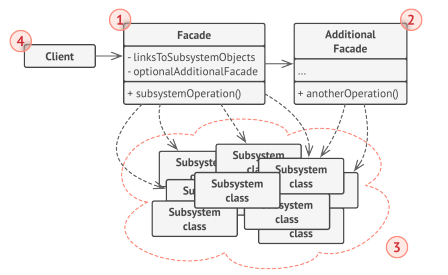

<h1 align="center">
   Facade
</h1>
<h3 align="center">
   Фасад
</h3>

**Фасад** — это структурный паттерн проектирования, который предоставляет простой интерфейс к сложной системе классов,
библиотеке или фреймворку.

Один из самых простых паттернов. Скорее всего вы его часто используете, даже не задумываясь, что это фасад.

Примеры, когда можно использовать паттерн фасад:

1. Когда вам нужно представить простой или урезанный интерфейс к сложной подсистеме.
2. Когда вы хотите разложить подсистему на отдельные слои.
3. Когда необходимо скрыть особенности реализации от пользователя.

<h3 align="center">
   Реализация
</h3>

1. Определите можно ли создать более простой интерфейс, чем тот, который предоставляет сложная подсистема. Вы на
   правильном пути, если этот интерфейс избавит клиента от знания о подробностях подсистемы.
2. Создайте класс фасада, реализующий этот интерфейс. Он должен переадресовывать вызовы клиента нужным объектам
   подсистемы. Фасад должен будет позаботиться о том, чтобы правильно инициализировать объекты подсистемы.
3. Вы получите максимум пользы, если клиент будет работать только с фасадом. В этом случае, изменения в подсистеме будут
   затрагивать только код фасада, а клиентский код останется рабочим.
4. Если ответственность фасада начинает размываться, подумайте о введении дополнительных фасадов.

<h3 align="center">
   Facade UML-диаграмма
</h3>

<h3>Плюсы</h3>

- Изолирует клиентов от компонентов системы.
- Уменьшает зависимость между подсистемой и клиентами.

<h3>Минусы</h3>

- Фасад рискует стать божественным объектом, привязанным ко всем классам программы.

<h3 align="center">
   Примеры
</h3>

- [Скрытие запуска и останова двигателя за фасадом.](code)

<h3 align="center">
  Источники
</h3>

- [Baeldung: Facade Design Pattern in Java](https://www.baeldung.com/java-facade-pattern)

- Design Patterns with
  Java: [Facade](books/Olaf%20Musch%20EN.pdf)
- Введение в паттерны
  проектирования: [Фасад](books/Alexander%20Shvets%20RU.pdf)