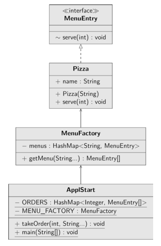

<h1 align="center">
   Flyweight
</h1>
<h3 align="center">
   Легковес
</h3>

**Легковес** — это структурный паттерн проектирования, который позволяет вместить бóльшее количество объектов в
отведённую оперативной память за счёт экономного разделения общего состояния объектов между собой, вместо хранения
одинаковых данных в каждом объекте.

***Внимание!** данный паттерн довольно сложен для понимания. Если вы не поймете с первого раза - это не страшно!* :grin:
*С примерами в интернете тоже все плохо...*

Примеры, когда можно использовать паттерн декоратор:

- Когда не хватает оперативной памяти для поддержки всех нужных объектов.

Эффективность паттерна Легковес во многом зависит от того, как и где он используется. Применяйте этот паттерн, когда
выполнены все перечисленные условия:

- в приложении используется большое число объектов;
- из-за этого высоки расходы оперативной памяти;
- большую часть состояния объектов можно вынести за пределы их классов;
- многие группы объектов можно заменить относительно небольшим количеством разделяемых объектов, поскольку внешнее
  состояние вынесено.

<h3 align="center">
   Реализация
</h3>

1. Разделите поля класса, который станет легковесом, на две части:
    - внутреннее состояние: значения этих полей одинаковы для большого числа объектов
    - внешнее состояние (контекст): значения полей уникальны для каждого объекта.
2. Оставьте поля внутреннего состояние в классе, но убедитесь, что их значения неизменяемы. Эти поля должны
   инициализироваться только через конструктор.
3. Превратите поля внешнего состояния в аргументы методов, где эти поля использовались. Затем, удалите поля из класса
4. Создайте фабрику, которая будет кешировать и повторно отдавать уже созданные объекты. Клиент должен запрашивать
   легковеса с определённым внутренним состоянием из этой фабрики, а не создавать его напрямую
5. Клиент должен хранить или вычислять значения внешнего состояния (контекст) и передавать его в методы объекта
   легковеса.

<h3 align="center">
   Flyweight UML-диаграмма с примером на пицце
</h3>

Придумать и привести какую-то общую диаграмму не получается.

<h3>Плюсы</h3>

- Экономит оперативную память.

<h3>Минусы</h3>

- Расходует процессорное время на поиск/вычисление контекста.
- Усложняет код программы за счёт множества дополнительных классов.

<h3 align="center">
   Примеры
</h3>

- [Легковес на примере меню в кафе.](code)

<h3 align="center">
   Источники
</h3>

- Design Patterns with
  Java: [Flyweight](books/Olaf%20Musch%20EN.pdf)
- Введение в паттерны
  проектирования: [Легковес](books/Alexander%20Shvets%20RU.pdf)