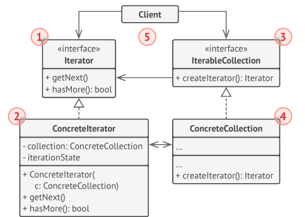

# Iterator

## Итератор

**Итератор** — это поведенческий паттерн проектирования, который даёт возможность последовательно обходить элементы
составных объектов, не раскрывая их внутреннего представления.

**Коллекции** — самая частая структура данных, которую вы можете встретить в программировании. Это набор объектов,
собранный
в одну кучу по каким-то причинам.

Идея паттерна Итератор в том, чтобы вынести поведение обхода коллекции из самой коллекции в отдельный класс. Объект
итератор будет отслеживать состояние обхода, текущую позицию в коллекции и сколько элементов ещё осталось обойти. Одну и
ту же коллекцию смогут одновременно обходить различные итераторы, а сама коллекция не будет даже знать об этом.

## Применимость

- Когда у вас есть сложная структура данных, и вы хотите скрыть от клиента детали её реализации (из-за сложности или
  вопросов безопасности).
- Когда вам нужно иметь несколько вариантов обхода одной и той же структуры данных.
- Когда вам хочется иметь единый интерфейс обхода различных структур данных.

## Реализация

В Java этот паттерн реализован через интерфейсы ```Iterator``` и ```Iterable```. Эти интерфейсы обеспечивают стандартный
способ
итерации по элементам коллекций, таких как списки, множества и другие.

### Интерфейс ```Iterator```

Интерфейс ```Iterator``` предоставляет методы для перебора элементов коллекции. Этот интерфейс содержит три основных
метода:

1. ```hasNext()```: Проверяет, есть ли еще элементы для итерации.
2. ```next()```: Возвращает следующий элемент коллекции.
3. ```remove()```: Удаляет текущий элемент, возвращенный методом ```next()```, из коллекции (необязательный метод,
   реализация которого может быть опущена).

```java
public interface Iterator<E> {
    boolean hasNext(); // Проверяет, есть ли еще элементы для итерирования

    E next();          // Возвращает следующий элемент коллекции

    default void remove() {
        throw new UnsupportedOperationException("remove");
    }
}
```

### Интерфейс ```Iterable```

Интерфейс ```Iterable``` определяет, что класс может быть итерируемым, то есть предоставляет возможность получить
итератор для последовательного доступа к элементам. Это базовый интерфейс для всех коллекций в Java (
например, ```List```, ```Set``` и т.д.).

Метод, который содержит интерфейс ```Iterable```:

- ```iterator()```: Возвращает объект типа Iterator, который используется для перебора элементов коллекции.

```java
public interface Iterable<T> {
    Iterator<T> iterator(); // Возвращает итератор для элементов коллекции
}
```

### Взаимодействие ```Iterator``` и ```Iterable```

Все коллекции в Java, такие как ```ArrayList```, ```HashSet```, и другие классы коллекций, реализуют
интерфейс ```Iterable```, что делает возможным использование цикла ```for-each```. Внутри коллекции реализован
метод ```iterator()```, который возвращает объект, реализующий интерфейс ```Iterator```.

Таким образом, ```Iterable``` — это интерфейс, который предоставляет итератор для коллекции, а ```Iterator``` — это
объект, который фактически выполняет перебор элементов.

### [Пример](code%2FMyArrayList.java) реализации паттерна ```Iterator``` на собственном ```ArrayList```

```java
import java.util.Iterator;

/**
 * Ниже приведен пример собственной реализации класса ArrayList, который поддерживает паттерн Итератор, используя
 * интерфейсы Iterable и Iterator. Итератор реализован с помощью анонимного класса в методе iterator().
 * <p>
 * ArrayList - реализация списка на основе массива.
 *
 * @param <T> generic тип
 */
public class MyArrayList<T> implements Iterable<T> {
    private T[] elements;                               //массив для хранения элементов
    private int size = 0;                               //
    private static final int DEFAULT_CAPACITY = 10;

    /**
     * Конструктор без параметров, создает массив с размером по умолчанию.
     */
    public MyArrayList() {
        elements = (T[]) new Object[DEFAULT_CAPACITY]; // Создаем массив с размером по умолчанию
    }

    /**
     * Добавление элемента в список
     *
     * @param element который будет добавлен
     */
    public void add(T element) {
        if (size == elements.length) resize(); // Увеличиваем массив, если места недостаточно
        elements[size++] = element;
    }

    /**
     * Метод для поулчения элемента по индексу.
     *
     * @param index индекс по которому необходимо получить элемент
     * @return найденный по индекс элементу если такой имеется
     */
    public T get(int index) {
        if (index < 0 || index >= size)
            throw new IndexOutOfBoundsException("Индекс вне допустимого диапазона: " + index);
        return elements[index];
    }

    /**
     * Метод получения размера коллекции.
     *
     * @return размер списка
     */
    public int size() {
        return size;
    }

    /**
     * Метод для увеличения размерности списка.
     * Увеличение списка в 2 раза.
     */
    private void resize() {
        T[] newArray = (T[]) new Object[elements.length * 2];              // Увеличиваем размер массива вдвое
        System.arraycopy(elements, 0, newArray, 0, size);   // Копирование элементов в массив большего размера
        elements = newArray;
    }

    /**
     * Реализация Итератор при помощи анонимного класса
     *
     * @return итератор списка
     */
    @Override
    public Iterator<T> iterator() {
        return new Iterator<>() {
            private int currentIndex = 0;   //По умолчанию начинаем итерацию с нулевого элемента

            /**
             * Проверка сущесвтуюет ли следующий элемент
             * (Проверка что не выгшли за границы массива)
             * @return true, если в границах массива иначе false.
             */
            @Override
            public boolean hasNext() {
                return currentIndex < size; // Проверяем, есть ли еще элементы для итерации
            }

            /**
             * Получение текущего элемента итератора.
             * @return возаращает элемент списка
             */
            @Override
            public T next() {
                if (!hasNext()) throw new IllegalStateException("Больше нет элементов");
                return elements[currentIndex++]; // Возвращаем текущий элемент и увеличиваем индекс
            }

            /**
             * Операция удаления элемента.
             * По умолчанию итератораторы не поддерживают данную операцию.
             */
            @Override
            public void remove() {
                throw new UnsupportedOperationException("Удаление не поддерживается");
            }
        };
    }
}
```

## UML-диаграмма



## Плюсы</h3>

- Упрощает классы хранения данных.
- Позволяет реализовать различные способы обхода структуры данных
- Позволяет одновременно перемещаться по структуре данных в разные стороны.

## Минусы

- Хороший паттерн, нет минусов

## [Задание](task%2Fiterator_task.md)

## Источники

- Design Patterns with
  Java: [Iterator](books/Olaf%20Musch%20EN.pdf)
- Введение в паттерны
  проектирования: [Итератор](books/Alexander%20Shvets%20RU.pdf)