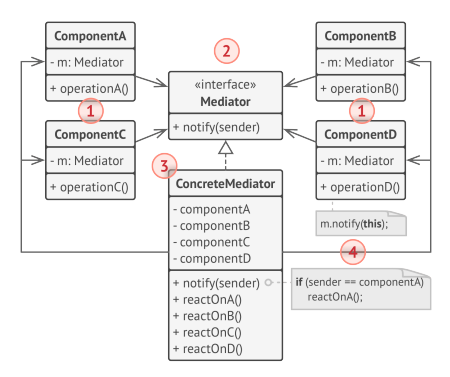

<h1 align="center">
   Mediator
</h1>
<h3 align="center">
   Посредник
</h3>

**Посредник** — это поведенческий паттерн проектирования, который позволяет уменьшить связанность множества классов
между собой, благодаря перемещению этих связей в один класс-посредник.

<h3 align="center">
   Применимость
</h3>

- Когда вам сложно менять некоторые классы из-за множества хаотичных связей с другими классами.
- Когда вы не можете повторно использовать класс, поскольку он зависит от уймы других классов.
- Когда вам приходится создавать множество подклассов компонентов, чтобы использовать одни и те же компоненты в разных
  контекстах

<h3 align="center">
   Реализация
</h3>

1. Найдите группу тесно переплетённых классов, отвязав которые друг от друга, можно получить некоторую пользу. Например,
   чтобы повторно использовать их код в другой программе.
2. Создайте общий интерфейс Посредников и опишите в нём методы для взаимодействия с Компонентами. В простейшем случае
   достаточно одного метода для получения оповещений от компонентов.
   Этот интерфейс необходим, если вы хотите повторно
   использовать классы компонентов для других задач. В этом
   случае, всё, что нужно сделать — это создать новый класс
   конкретного посредника.
3. Реализуйте этот интерфейс в классе Конкретного посредника. Поместите в него поля, которые будут содержать ссылки на
   все объекты компонентов.
4. Вы можете пойти дальше и переместить код создания компонентов в класс Конкретного посредника, превратив его в фабрику
5. Компоненты тоже должны иметь ссылку на объект посредника. Связь между ними удобней всего установить, подавая
   посредника в параметры конструктора компонентов.
6. Измените код компонентов так, чтобы они вызывали метод оповещения посредника, а не методы других компонентов. С
   другой стороны, посредник должен вызывать методы нужного компонента, когда получает оповещение.

<h3 align="center">
   Mediator UML-диаграмма
</h3>

<h3>Плюсы</h3>

- Устраняет зависимости между компонентами, позволяя повторно их использовать.
- Упрощает взаимодействие между компонентами.
- Централизует управление в одном месте.

<h3>Минусы</h3>

- Посредник может сильно раздуться и легко превратиться в God-класс.

<h3 align="center">
   Примеры
</h3>

- В паттерне Model-View-Controller, controller является посредником между view/use и model.
- [Реализация чат-команты на примере посредника.](code)

Между **Mediator** и **Observer** по началу сложно уловить разницу.

<h5>
   Если по-умному, то их различие в следующем:
</h5>

Паттерн **Observer** уменьшает связанность за счёт обращения зависимостей. Он хорошо применим, когда есть несколько
источников событий и много слушателей, которые добавляются динамически. Другим хорошим примером использования этого
паттерна является реактивное программирование, когда изменение состояния одного объекта приводит к изменению состояния
всех зависимых от него объектов и так далее.

Паттерн **Mediator** уменьшает связанность системы за счёт того, что все зависимости уходят в один класс медиатор, а все
остальные классы становятся независимы и отвечают только за логику, которую они выполняют. Таким образом, добавление
новых классов становится проще, но с каждым новым классом логика медиатора сильно усложняется.

<h5>
   Если пытаться объяснить проще:
</h5>

Паттерн **Observer** нужен когда мы хотим, чтобы на изменение одного объекта реагировало множество (даже если множество
состоит из 1ого) других объектов. При этом мы не хотим, что этот объект-издатель (на изменение состояния которого мы
реагируем) знал о подписчиках (объектах, которые реагируют на его изменение). *Связь одностроняя, подписичик знают об
издателе, но издатель не знает о подписчиках*

Паттерн **Mediator** позволяет вынести обоюдные связи множества объектов в отдельный класс. При этом все объекты будут
знать только о mediator'е, но не друг о друге. То есть в данном случае mediator можно представить в виде шины общения.
*Все знают о mediator'e, внутри него уже происходит связь, причем в основном двустороняя*.

<h3 align="center">
   Источники
</h3>

- Design Patterns with
  Java: [Mediator](books/Olaf%20Musch%20EN.pdf)
- Введение в паттерны
  проектирования: [Посредник](books/Alexander%20Shvets%20RU.pdf)