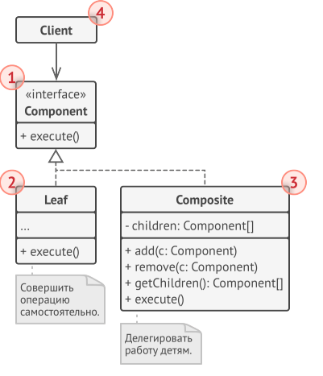

<h1 align="center">
   Composite
</h1>
<h3 align="center">
   Компоновщик
</h3>

**Компоновщик** — это структурный паттерн проектирования, который позволяет сгруппировать объекты в древовидную
структуру, а затем работать с ними так, если бы это был единичный объект.

***Компоновщик** - это дерево!*

Паттерн Компоновщик имеет смысл только тогда, когда основная модель вашей программы может быть структурирована в виде
дерева.

<h3 align="center">
   Реализация
</h3>

1. Убедитесь, что вашу бизнес-логику можно представить как древовидную структуру. Попытайтесь разбить её на простые
   элементы и контейнеры. Помните, что контейнеры могут содержать как простые элементы, так и другие контейнеры.
2. Создайте общий интерфейс компонентов, который объединит операции контейнеров и простых элементов дерева. Интерфейс
   будет удачным, если вы сможете взаимозаменять простые и составные компоненты без потери смысла.
3. Создайте класс компонентов-листьев, не имеющих дальнейших ответвлений. Имейте в виду, что программа может содержать
   несколько видов таких классов.
4. Создайте класс компонентов-контейнеров, и добавьте в него массив для хранения ссылок на вложенные компоненты. Этот
   массив должен быть способен содержать как простые, так и составные компоненты, поэтому убедитесь, что он объявлен с
   типом интерфейса компонентов. Реализуйте в контейнере методы интерфейса компонентов, помня о том, что контейнеры
   должны делегировать основную работу своим дочерним компонентам.
5. Добавьте операции добавления и удаления дочерних элементов в класс контейнеров. Имейте в виду, что методы
   добавления/удаления дочерних элементов можно поместить и в интерфейс компонентов. Да, это нарушит принцип разделения
   интерфейса, так как реализации методов будут пустыми в компонентах-листьях. Но зато все компоненты дерева станут
   действительно одинаковыми для клиента.

<h3 align="center">
   Composite UML-диаграмма
</h3>

<h3>Плюсы</h3>

- Упрощает архитектуру клиента при работе со сложным деревом компонентов.
- Облегчает добавление новых видов компонентов.

<h3>Минусы</h3>

- Создаёт слишком общий дизайн классов.

<h3 align="center">
   Примеры
</h3>

- [Дерево товаров и контейнеров товаров](code)

<h3 align="center">
   Источники
</h3>

- Design Patterns with
  Java: [Composite](books/Olaf%20Musch%20EN.pdf)
- Введение в паттерны
  проектирования: [Компоновщик](books/Alexander%20Shvets%20RU.pdf)