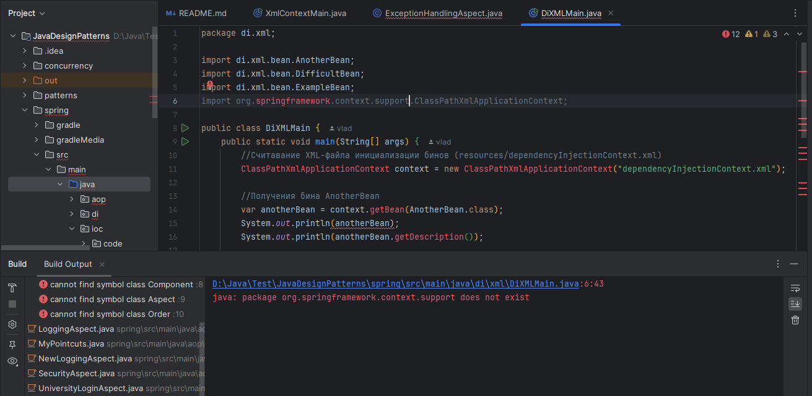
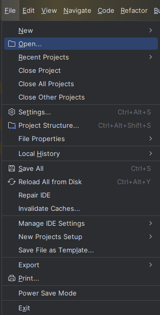
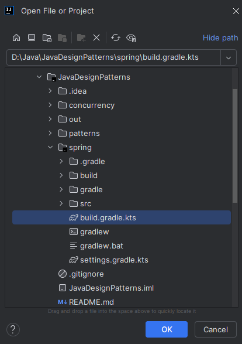
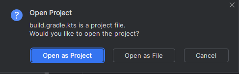
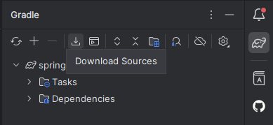
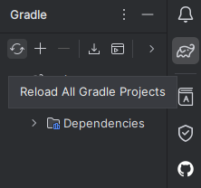

#    Как запустить проект 

Поскольку данный проект со Spring и сборщиком проектов Gradle является модулем другого проект (проект в проекте) , то
при клонировании с гита может получиться следующая ситуация:

Не читаются зависимости загруженные Gradle. У данной проблемы есть несколько путей решения, самый простой заключается в
том, чтобы открыть данный модуль как отдельный Gradle проект в Intellij IDEA.

##  Шаг 1. В меню File Intellij IDEA выбрать пункт Open

##  Шаг 2. Выбрать данный модуль. ОБЯЗАТЕЛЬНО выбираем файл build.gradle.kts для отркытие и сборки проект через Gradle!!!

## Шаг 3. Open as project.

Далее выбираете открыть в этом окне или новом на ваше усмотрение.

## Шаг 4. Ждем сборки

Сборка жолжна начаться автоматически. По её окончанию всё должно начать работать.

В противном случае, если автомаической загрузки не происходит вы всегда можете загрузить зависимости:

И пересобрать проект:

Эти действий должно хватит. Если не работает - значит проблемы уже не в Gradle проекте, а где-то на другом уровне.

### Удачи в постижении Spring.
